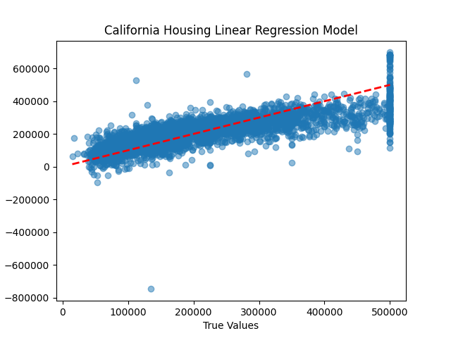

# California Housing Data Analytics 

The problem at hand is to predict the median house value in the California Housing dataset. This is a **regression problem**, as the target variable is a continuous value representing the median house value for a given area. 
 
# Dataset

Upon doing research, I found that the California Housing dataset comprises information collected from the 1990 California census. The data contains information of houses found in a given California district and has 9 features including:

- longitude: A measure of how far west a house is (a higher value is farther west)
- latitude: A measure of how far north a house is (a higher value is farther north)
- housing_median_age: Median age of a house within a block (a lower number is a newer building)
- total_rooms: Total number of rooms within a block
- total_bedrooms: Total number of bedrooms within a block
- population: Total number of people residing within a block
- households: Total number of households (a group of people residing together) within a block
- median_income: Median income for households within a block (measured in tens of thousands of US Dollars)
- median_house_value: Median house value for households within a block (measured in US Dollars)

The goal is to build a machine learning model using the available features to predict the median_house_value. To achieve this, we split the dataset into training and testing sets, trained a linear regression model on the training set, and evaluated its performance on the test set using metrics like Mean Squared Error (MSE), Mean Absolute Error (MAE), and R-squared.

# Results 

```
Mean Squared Error: 5085925812.27
Mean Absolute Error: 51487.15
R-squared: 0.62
```

# Conclusions
The linear regression model successfully learned the relationship between the features and the target variable (median house value) to some extent, however, the obtained evaluation metrics (MSE, MAE, and R-squared) can be further analyzed to determine the quality of the predictions made by the model. Comparing these metrics with those of other models or a baseline would provide more insights into the model's performance.

**Specifically going over the metrics**:

The linear regression model was able to capture some patterns in the data, as indicated by the R-squared value of 0.62. This value, however, also suggests that there is room for improvement, as 38% of the variance in the median house values is unexplained by the model.

The Mean Absolute Error (MAE) of 51,487.15 suggests that the model's predictions, on average, deviate from the true median house values by approximately $51,487. Depending on the range and distribution of house prices in California, this error may be considered high or low. If the range of house prices is wide and spans several hundred thousand dollars or more, the average error might be considered reasonable. However, if the range is narrower, this error could be considered substantial.

The Mean Squared Error (MSE) of 5,085,925,812.27 is difficult to interpret directly as it is such a large number. I believe it can suggest that the model's predictions have significant deviations from the true values when considering the squared differences. This might be an indication that the model struggles with certain data points or outliers.

**Further conclusions**

Additionally, it might be beneficial to explore other regression models, such as Decision Trees, Random Forests, or Gradient Boosting, to find a model that can better capture the underlying patterns in the data. Feature engineering, hyperparameter tuning, and cross-validation techniques can also be applied to improve the model's performance.

In conclusion, the linear regression model serves as a starting point for predicting median house values using the California Housing dataset. Further experimentation and analysis are needed to identify the most suitable model and optimize its performance.


